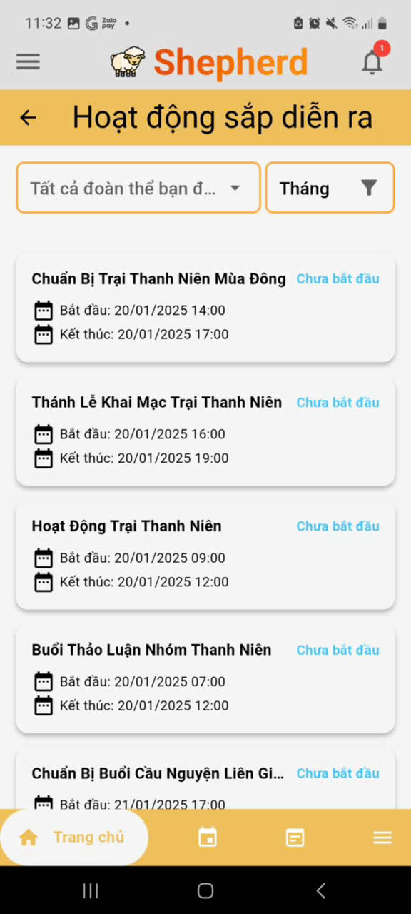
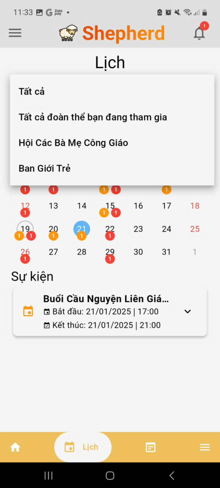
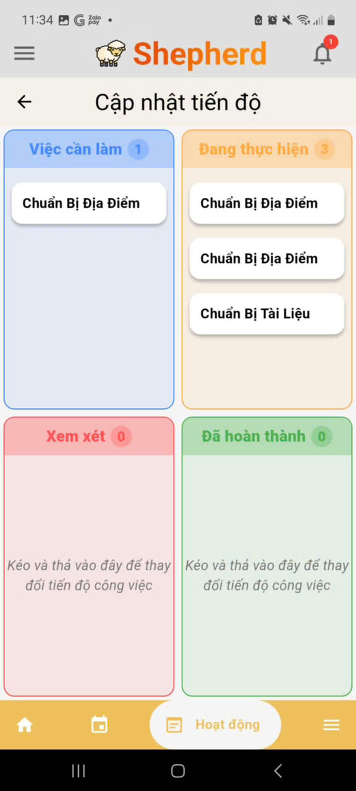

# Shepherd

A **Flutter**-powered system designed for managing the activities of organizations within a **Catholic Parish Church**. Shepherd Mo streamlines communication, event management, task tracking, and user interactions with a modern, feature-rich mobile experience.

---

## 🚀 Features

✅ **Real-time Notifications** – Stay updated instantly with push notifications that can navigate to relevant sections.

✅ **Kanban Task Management** – Organize and update progress in a dynamic and intuitive Kanban board.

✅ **Multi-language Support** – Available in **English** and **Vietnamese**.

✅ **Dark Mode** – Seamless switching between light and dark themes.

✅ **Advanced Navigation** – Multiple navigation flows ensure a smooth user experience.

✅ **Profile Customization** – Choose an image from the gallery or take a picture to update your profile.

✅ **Permission Handling** – Secure and user-friendly permissions for profile updates.

✅ **Event & Activity Management** – Plan, schedule, and track events and activities efficiently.

✅ **Flutter Mobile App** – Built with **Flutter** and **Firebase** for a fast and scalable experience.

---

## 📸 Screenshots

### 🔑 Login


### 🏠 Home





### 🔔 Notifications & Requests


### 📅 Schedule Management





### 📌 Activities & Task Management





### ⚙️ Settings & Customization


---

## 📥 Getting Started

### Prerequisites

- **Flutter** (latest stable version)
- **Dart** SDK
- **Firebase** setup for notifications and real-time updates

### Installation

```sh
flutter pub get
flutter run
```

### Building for Release

```sh
flutter build apk --release
flutter build ios --release --no-codesign
```

---

## 🛠️ Technologies Used

- **Flutter** – UI framework
- **Firebase** – Backend services (Auth, Firestore, Cloud Messaging)
- **SignalR** – Backend services (C#, deactivated)
- **GetX & Provider** – State management
- **SharedPreferences** – Local storage
- **AdvancedSwitch** – Theme toggling

---

## 🎯 Roadmap

- [ ] Implement Admin Dashboard
- [ ] Add More Notification Features
- [ ] Support More Languages

---

## 📬 Contact & Support

For any issues or feature requests, please open an issue or contact us directly.

---

**Shepherd** – A system for managing activities of organizations in a Catholic Parish Church, built with ❤️ using Flutter.
